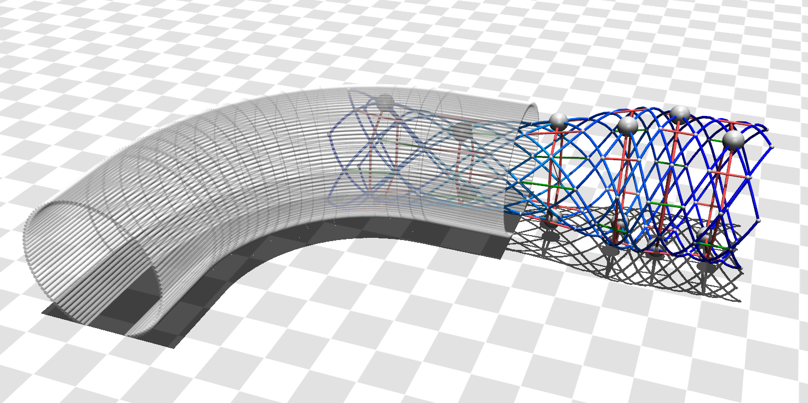

 

# 3D Worm Robot Model

This repository contains a model of an earthworm inspired soft robot built in the physics engine Mujoco, as well as a variety of testing environments used to tune the model and study peristaltic locomotion behavior.

There are two folders: Mechanical_Analysis_Model and Feedback_Control_Model. The first contains the files associated with our initial model, which was intended for mechanical analysis (https://doi.org/10.1088/1748-3190/ae0631). The second contains our updated model, which builds upon the previous work with improved mechanical properties and sensing to enable continuous closed-loop control (In-proceedings).

### Building the Model
Mujoco compiles models into the simulation environment from an xml file or object. The xml file for this robot can be auto-generated using the `master_worm.m` file in the worm_modeling folder. Working examples are also included: in Mechanical_Analysis the most updated model is `worm_test_connector_mass.xml` and its variants, in Feedback_Control the most updated model is `worm_extra_sensors.xml`. Some alterations to the MATLAB generated xml code may be required. Please note that changes to the model will necessitate minor changes to the code (accounting for new sensor length tolerances, more segments, etc.).

### Running the Model
The python script `Time_Based_Worm.py` runs the simulation in the Mechanical_Analysis_Model folder. The `Lin_Turning_Sense.py` script, and its variants, run the simulation in the Feedback_Control_Model folder.

### Plotting
Additional python scripts for plotting the figures in the associated publications have been included. Our csv files were too large to upload to this repository so data will need to be generated before these can be used.

### Necessary Packages
To run this model you will need to have mujoco installed. We have verified compatibility up to Mujoco 3.4.0. Note that MuJoCo 3.4.0 only supports up to Python 3.13.

https://github.com/deepmind/mujoco/releases

## Associated Publications
If you use or refer to this model in your own work, please cite at least one of the following papers:

[1] Riddle SA, Jackson CB, Daltorio KA, Quinn RD. A 3D model predicts behavior of a soft bodied worm robot performing peristaltic locomotion. Bioinspiration & Biomimetics. 2025;20(6):066001. https://doi.org/10.1088/1748-3190/ae0631

[2] Coming Soon

### Citations for functions used in the MATLAB scripts
[1]  Wouter Falkena (2023). xml2struct (https://www.mathworks.com/matlabcentral/fileexchange/28518-xml2struct), MATLAB Central File Exchange. Retrieved May 22, 2023.

[2]  Wouter Falkena (2023). struct2xml (https://www.mathworks.com/matlabcentral/fileexchange/28639-struct2xml), MATLAB Central File Exchange. Retrieved May 22, 2023.
